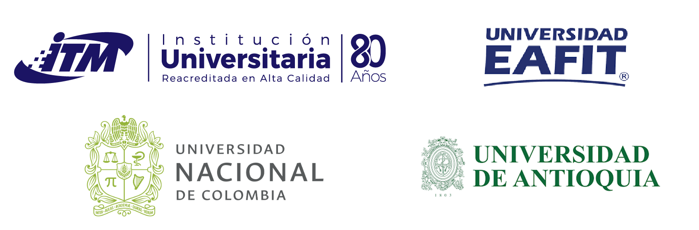

 

To visit our webpage in Spanish click in the next link:

[https://rday-colombia.github.io/2025/](https://rday-colombia.github.io/2025/)

 

R Day is an event that has had a positive impact on the scientific and business communities due to the versatility of the R programming language for statistics and data science.

R Day has been held twice in Medellín ([2019](https://rday-colombia.github.io/2019/) and [2023](https://rday-colombia.github.io/2023/)), and this year it will take place for the third time in Medellín, in person on November 14, 2025. With R Day, we aim to bring together the community of R users in the city of Medellín and attract the attention of those who are not yet familiar with it.

 
 

<h1> Organize </h1>

     
 
 
     
<h1> Sponsors </h1>

     
 
     

     
 

     

 
 

Site visit map.

